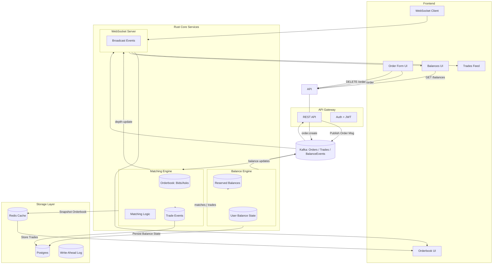

[more infor here](github.com/NalinDalal/exchange-ts)

```mermaid
flowchart TD

    %% ====================================
    %% FRONTEND (Next.js / TS)
    %% ====================================

    subgraph FE[Frontend]
        FO[Order Form UI]
        OB[Orderbook UI]
        TF[Trades Feed]
        BL[Balances UI]
        WSClient[WebSocket Client]
    end

    FO -->|POST /order| API
    FO -->|DELETE /order| API
    BL -->|GET /balances| API
    WSClient --> WS


    %% ====================================
    %% BACKEND NODE (TypeScript REST)
    %% ====================================

    subgraph TS[API Gateway ]
        TSAPI[REST API]
        AUTH[Auth + JWT]
    end

    API --- TSAPI
    TSAPI -->|Publish Order Msg| KAFKA


    %% ====================================
    %% MESSAGE BUS
    %% ====================================

    KAFKA[(Kafka: Orders / Trades / BalanceEvents)]


    %% ====================================
    %% RUST MATCHING ENGINE
    %% ====================================

    subgraph RS[Rust Core Services]

        subgraph ME[Matching Engine]
            OBIDX[(Orderbook: Bids/Asks)]
            MATCH[Matching Logic]
            TRADELOG[(Trade Events)]
        end

        subgraph BAL[Balance Engine]
            BALDB[(User Balance State)]
            RESV[(Reserved Balances)]
        end

        subgraph WS[WebSocket Server]
            WSBROAD[Broadcast Events]
        end

    end


    %% ===============================
    %% BACKEND STORAGE
    %% ===============================

    subgraph STORE[Storage Layer]
        PG[(Postgres)]
        REDIS[(Redis Cache)]
        WAL[(Write-Ahead Log)]
    end

    %% ====================================
    %% MESSAGE FLOW
    %% ====================================

    TSAPI -->|order.create| KAFKA
    KAFKA --> ME
    ME -->|matches / trades| BAL
    ME -->|depth-update| WS
    ME --> TRADELOG

    BAL -->|balance updates| KAFKA
    KAFKA --> TSAPI
    KAFKA --> WS

    RESV --> BAL


    %% ====================================
    %% STORAGE & CACHING
    %% ====================================

    ME -->|Snapshot Orderbook| REDIS
    BAL -->|Persist Balance State| PG
    TRADELOG -->|Store Trades| PG

    REDIS --> OB
    WS --> OB
    WS --> TF
    WS --> BL
```
